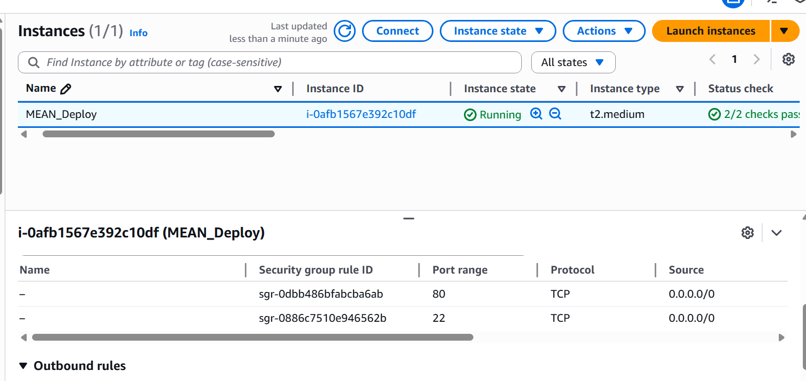

# MEAN Stack Tutorial Management App (Docker & CI/CD)

This repository contains the source code and deployment configuration for a full-stack **MEAN** (MongoDB, Express, Angular, Node.js) application.

**Application Overview:**
The application manages a collection of **Tutorials**.

* **Data Model:** ID, title, description, and published status.

* **Features:** Create, Retrieve, Update, and Delete (CRUD) tutorials.

* **Search:** Users can search for tutorials by title.

The project features a complete DevOps pipeline, including containerization with Docker, orchestration with Docker Compose, a reverse proxy via Nginx, and automated deployment to AWS EC2 using GitHub Actions.

## 🏗 System Architecture

The application is deployed as a set of microservices on a single Docker host.

* **Frontend**: Angular application served via Nginx (Port 80).

* **Backend**: Node.js/Express API (Port 8080).

* **Database**: MongoDB container (Port 27017).

* **Reverse Proxy**: Main Nginx container acting as the gateway, routing traffic to frontend or backend based on the URL.

## 📋 Prerequisites

Before you begin, ensure you have the following:

1. **Docker & Docker Compose** installed locally.

2. **AWS Account** (to launch an EC2 instance).

3. **Docker Hub Account** (to push images).

4. **GitHub Repository** (to host this code).

5. *(For Manual Setup only)* **Node.js** and **MongoDB** installed locally.

## 🔧 Manual Local Setup (Development Mode)

If you wish to run the application **without Docker** (e.g., for local development), follow these steps.

**Prerequisite:** Ensure a local MongoDB instance is running.

### 1. Node.js Server (Backend)

1. Navigate to the backend directory:

   ```bash
   cd backend
   ```
2.  Install dependencies:

    ```bash
    npm install
    ```

3.  **Database Configuration:**

      * You can update the MongoDB credentials/URI by modifying the `db.config.js` file located in `app/config/`.
      * *Note:* For local manual setup, ensure the URI points to `localhost`. For Docker setup, it should point to the `mongo` service container.

4.  Start the server:

    ```bash
    node server.js
    ```

### 2\. Angular Client (Frontend)

1.  Open a new terminal and navigate to the frontend directory:

    ```bash
    cd frontend
    ```

2.  Install dependencies:

    ```bash
    npm install
    ```

3.  **API Configuration:**

      * You can modify the `src/app/services/tutorial.service.ts` file to adjust how the frontend interacts with the backend (e.g., changing the base API URL).

4.  Start the application:

    ```bash
    ng serve --port 8081
    ```

5.  **Access the App:**

      * Navigate to `http://localhost:8081/` in your browser.

## 🚀 Docker Local Setup (Production Simulation)

You can run the entire application (Frontend, Backend, Database, Nginx) locally using Docker Compose. This does **not** require Node or Mongo to be installed on your machine, only Docker.

1.  **Clone the repository:**

    ```bash
    git clone [https://github.com/HitanshuGupta/CURD_MEAN_WEBAPP_DEPLOYMENT](https://github.com/HitanshuGupta/CURD_MEAN_WEBAPP_DEPLOYMENT)
    cd YOUR_REPO_NAME
    ```

2.  **Build and Run:**

    ```bash
    docker compose up -d --build
    ```

3.  **Access the App:**

      * **Frontend:** Open `http://localhost` (Served via Nginx on Port 80, internally routing API calls).
      * *Note:* The Docker setup maps Port 80, whereas manual setup used 8081.

4.  **Stop the App:**

    ```bash
    docker compose down
    ```

## ☁️ Infrastructure Setup (AWS EC2)

Follow these steps to provision the server for deployment.

### 1\. Launch EC2 Instance

  * **OS:** Ubuntu 22.04 LTS (t2.medium recommended for builds, t2.micro for running).
  * **Key Pair:** Create and download a new `.pem` key pair.
  * **Security Group:** Allow Inbound Traffic:
      * `SSH` (Port 22)
      * `HTTP` (Port 80)

### 2\. Install Docker on EC2

Connect to your instance via SSH and run:

```bash
# Update and install Docker
sudo apt-get update
sudo apt-get install -y docker.io docker-compose-plugin

# Add ubuntu user to docker group (avoids using sudo for docker commands)
sudo usermod -aG docker ubuntu

# Disconnect and reconnect for changes to take effect
exit
ssh -i "your-key.pem" ubuntu@your-ec2-ip
```

## 🔄 CI/CD Pipeline Configuration

We use **GitHub Actions** to automate the deployment. The workflow is defined in `.github/workflows/deploy.yml`.

### 1\. Secrets Configuration

Go to **Settings \> Secrets and variables \> Actions** in your GitHub repository and add the following secrets:

| Secret Name | Description |
| :--- | :--- |
| `DOCKER_USERNAME` | Your Docker Hub username. |
| `DOCKER_PASSWORD` | Your Docker Hub password or access token. |
| `HOST_DNS` | The Public IPv4 address (or DNS) of your EC2 instance. |
| `USERNAME` | The SSH username (usually `ubuntu`). |
| `EC2_SSH_KEY` | The **entire content** of your `.pem` key file. |

### 2\. Pipeline Workflow

Every time code is pushed to the `main` branch, the pipeline will:

1.  **Build** Docker images for Frontend, Backend, and Nginx.
2.  **Push** these images to Docker Hub.
3.  **SSH** into the EC2 instance.
4.  **Pull** the latest images.
5.  **Restart** the containers using `docker compose up`.

## 📸 Deployment Screenshots

### 1\. CI/CD Execution

*Screenshot of the GitHub Actions tab showing a successful "Build and Deploy" workflow run.*

### 2\. Docker Hub Images

*Screenshot of Docker Hub showing the pushed repositories (backend, frontend, nginx).*

### 3\. Application Deployment

*Screenshot of the browser accessing the application via the EC2 Public IP.*


### 4\. Nginx & Infrastructure

*Screenshot of the terminal showing `docker ps` running on the EC2 instance.*

## 🛠️ Troubleshooting

  * **Database Connection Fail:**

      * **Docker:** Ensure backend connection string is `mongodb://mongo:27017/...`.
      * **Manual:** Ensure backend connection string is `mongodb://localhost:27017/...`.

  * **Permission Denied (Docker):** Ensure you ran `sudo usermod -aG docker ubuntu` and re-logged in.

  * **GitHub Action SSH Timeout:** Check if the EC2 Security Group allows Port 22 from `0.0.0.0/0` (or GitHub IP ranges).


